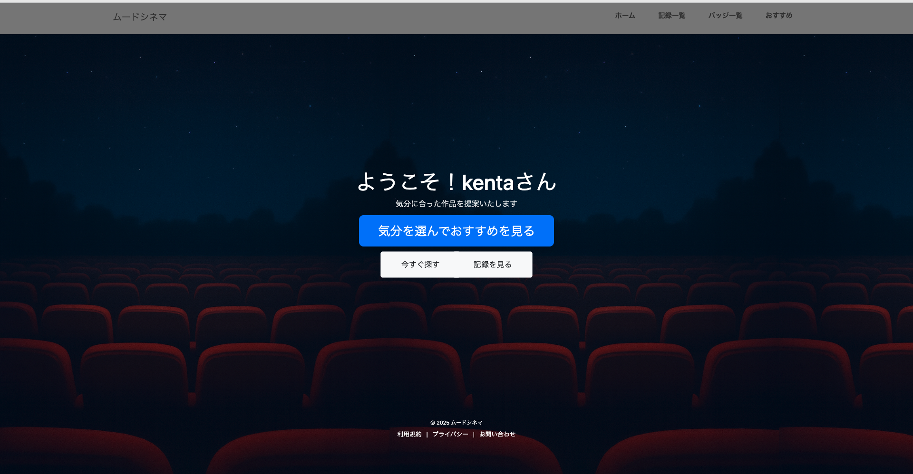
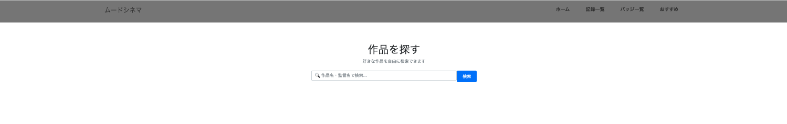
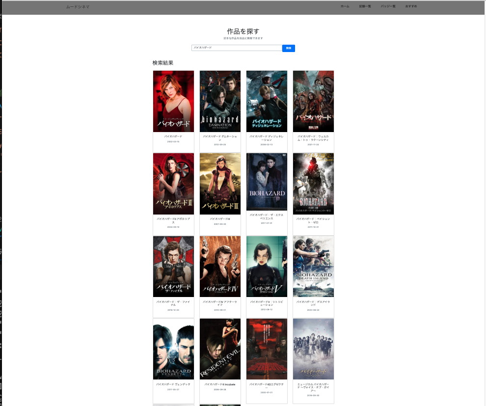

# 🎞️ MoodCinema – ムードで選び、記録し、継続できる映画記録サービス

---

## 1. サービス概要

**MoodCinema** は、  
「映画を観たいけれど、何を選べばよいか迷う」  
という課題を解決する映画検索・記録アプリです。

- ムード別映画検索（元気出したい / 癒されたい / 泣きたい / 集中したい）
- TMDB API による映画情報の自動取得  
- レビュー・評価の記録  
- ミッション達成でバッジ獲得（継続を促す仕組み）

映画選びのハードルを下げ、継続的に記録する楽しさを提供します。

---

## 2. 主な機能一覧

### ■ ユーザー向け機能
- ムード検索  
- 映画情報自動取得（タイトル / ポスター / ジャンル / 監督）  
- 視聴記録（評価・レビュー）  
- 視聴数の集計（合計・月別）  
- ミッション達成 → バッジ獲得  

### ■ 技術のポイント
- Django（CBV / Forms / Services）
- TMDB API 連携  
- Django Test（Model / View / Service）  

---

## 3. 画面内容

###  ログイン画面　　/　ホーム画面
<table>
  <tr>
    <th style="text-align:center;">ログイン画面</th>
    <th style="text-align:center;">ホーム画面</th>
  </tr>

  <tr>
    <td width="50%" align="center">
      
    </td>
    <td width="50%" align="center">
      
    </td>
  </tr>

  <tr>
    <td style="padding: 10px;">
       メールアドレスとパスワードによるログイン機能を提供しています。認証が完了すると、ユーザーごとの映画記録・おすすめ情報に安全にアクセスでき、個人データを保持した状態でアプリを利用できます。
    </td>
    <td style="padding: 10px;">
      ログイン後に表示されるホーム画面では、「気分から探す」「作品名で探す」「鑑賞記録を確認する」といった主要機能へワンクリックでアクセスできます。
      ユーザーが次に取りたい行動を迷わず選べるよう、機能導線を集約しています。
    </td>
  </tr>
</table>

### いますぐ探す画面　　/　映画作品検索結果
<table>
  <tr>
    <th style="text-align:center;">いますぐ探す画面</th>
    <th style="text-align:center;">映画作品検索結果画面</th>
  </tr>

  <tr>
    <td width="40%" align="center">
      
    </td>
    <td width="50%" align="center">
      
    </td>
  </tr>

  <tr>
    <td style="padding: 10px;">
      映画作品の検索画面に遷移します。
    </td>
    <td style="padding: 10px;">
      シリーズものは全作品出力されます。
    </td>
  </tr>

</table>

 
---

